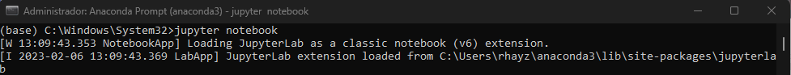
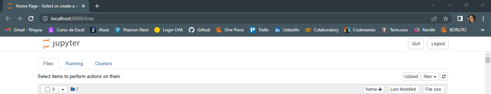

### Preparando Ambiente de trabalho

No presente trabalho, utilizaremos a plataforma Jupyter Notebook para análise do arquivo [diamonds.csv](link).

Para isso, será necessário o download e configuração do ambiente, no SO Windows 10. Serão necessários 5 etapas para conclusão da configuração.

> Etapa 1: Download e instação do [Python](https://www.python.org/) 
> Etapa 2: Download e instalação do [Anaconda](https://www.anaconda.com/) 
> Etapa 3: Instalação do [Java](https://www.java.com/pt-BR/download/manual.jsp) 
> Etapa 4: Instação do PySpark 
> Etapa 5: Validação 

# Etapa 1: Download e instação do Python

Vá em https://www.python.org/  e clique em download Latest, como na imagem:

Escolha a versão que melhor atende seu sistema operacional.

Siga os passos do executável para concluir a instalação.

# Etapa 2: Download e instalação do Anaconda

Vá em https://www.anaconda.com/ e clique no botão com a imagem do sistema operacional que você utiliza. Complete o download e instação do executável.

# Etapa 3: Instalação do Java

PySpark utiliza Java como dependência, portanto, você precisa ter Java no seu Windows. Para instalá-lo, vá em https://www.java.com/pt-BR/download/manual.jsp e faça o download e instalação pelo executável.

# Etapa 4: Instação do PySpark

Para instalar o PySpark no Anaconda, vá no prompt de comando do Anaconda, clique com o botão direito e clique em `Executar como administrador`.

No terminal, digite `pip install pyspark`. Aguarde a instalação.

# Etapa 5: Validação

Ainda no terminal do Anaconda, digite `jupyter notebook` para abrir o Jupyter Notebook.

Abra um novo notebook Python 3.

Na primeira célula, digite `import pyspark` e clique em `run`.

Não deve ter nenhuma saída.